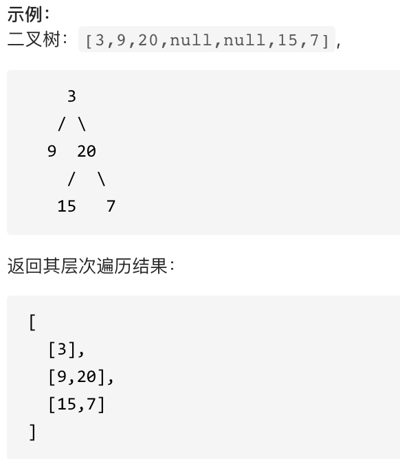
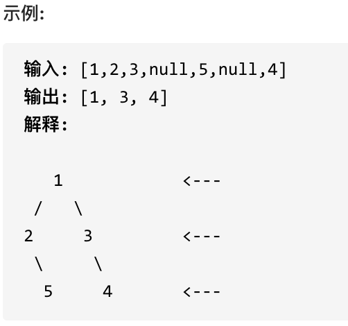
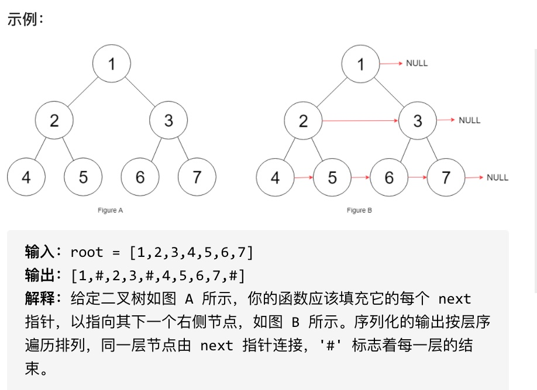

# 06.Tree（二叉树）

## 0、 基础理论

### 0.1、 二叉树的种类

二叉树有两种主要的形式：满二叉树和完全二叉树。

#### 0.1.1、 满二叉树

满二叉树：如果一棵二叉树只有度为 0 的结点和度为 2 的结点，并且度为 0 的结点在同一层上，则这棵二叉树为满二叉树。

如下图所示，这棵二叉树为满二叉树，也可以说深度为 k，有 2^k-1 个节点的二叉树。


#### 0.1.2、 完全二叉树

完全二叉树：除了最底层节点可能没填满外，其余每层节点数都达到最大值，并且最下面一层的节点都集中在该层最左边的若干位置。若最底层为第 h 层（h 从 1 开始），则该层包含 1~ 2^(h-1) 个节点。


#### 0.1.3、 二叉搜索树

二叉搜索树是一个有序树。

- 若它的左子树不空，则左子树上所有结点的值均小于它的根结点的值；
- 若它的右子树不空，则右子树上所有结点的值均大于它的根结点的值；
- 它的左、右子树也分别为二叉搜索树。


#### 0.1.4、 平衡二叉搜索树

平衡二叉搜索树：又被称为 AVL（Adelson-Velsky and Landis）树，且具有以下性质：它是一棵空树或它的左右两个子树的高度差的绝对值不超过 1，并且左右两个子树都是一棵平衡二叉树。


### 0.2、 二叉树的存储方式

二叉树可以链式存储，也可以顺序存储。那么链式存储方式就用指针， 顺序存储的方式就是用数组。

顾名思义就是顺序存储的元素在内存是连续分布的，而链式存储则是通过指针把分布在各个地址的节点串联一起。

链式存储如图：


顺序存储其实就是用数组来存储二叉树。

顺序存储如图：


用数组来存储二叉树如何遍历的呢？

如果父节点的数组下标是 i，那么它的左孩子就是 i _ 2 + 1，右孩子就是 i _ 2 + 2。

但是用链式表示的二叉树，更有利于理解，所以一般都是用链式存储二叉树。

### 0.3、 二叉树的遍历方式

二叉树主要有两种遍历方式：

1. 深度优先遍历：先往深走，遇到叶子节点再往回走。
2. 广度优先遍历：一层一层的去遍历。

从深度优先遍历和广度优先遍历进一步拓展，才有如下遍历方式：

- 深度优先遍历
  - 前序遍历（递归法，迭代法）
  - 中序遍历（递归法，迭代法）
  - 后序遍历（递归法，迭代法）
- 广度优先遍历 -层次遍历（迭代法）

在深度优先遍历中：有三个顺序，前中后序遍历，这里前中后，指的就是中间节点的遍历顺序，只要记住`前中后`序指的就是中间节点的位置就可以了。

看如下中间节点的顺序，就可以发现，中间节点的顺序就是所谓的遍历方式。

```
前序遍历：中左右
中序遍历：左中右
后序遍历：左右中
```

如下图所示：


栈其实就是递归的一种实现结构，也就说前中后序遍历的逻辑其实是可以借助栈使用递归的方式来实现的。

而广度优先遍历的实现一般使用队列来实现，这也是队列先进先出的特点所决定的，因为需要先进先出的结构，才能一层一层的来遍历二叉树。

### 0.4、 二叉树的定义

顺序存储就是用数组来存，链式存储的二叉树节点的定义如下：

```java
public class TreeNode {
    public int value;
    public TreeNode left;
    public TreeNode right;

    public TreeNode() {
    }

    public TreeNode(int value) {
        this.value = value;
    }

    public TreeNode(int value, TreeNode left, TreeNode right) {
        this.value = value;
        this.left = left;
        this.right = right;
    }
}
```

## 1、 二叉树的递归遍历

使用指定的遍历方式打印二叉树各个节点的数值。

**递归算法的三个要素：**

1. `确定递归函数的参数和返回值`： 确定哪些参数是递归的过程中需要处理的，那么就在递归函数里加上这个参数， 并且还要明确每次递归的返回值是什么进而确定递归函数的返回类型。
2. `确定终止条件`： 写完了递归算法, 运行的时候，经常会遇到栈溢出的错误，就是没写终止条件或者终止条件写的不对，操作系统也是用一个栈的结构来保存每一层递归的信息，如果递归没有终止，操作系统的内存栈必然就会溢出。
3. `确定单层递归的逻辑`： 确定每一层递归需要处理的信息。在这里也就会重复调用自己来实现递归的过程。

**以前序遍历为例：**

1. 确定递归函数的参数和返回值：因为要打印出前序遍历节点的数值，所以参数里需要传入 List 来放节点的数值，除了这一点就不需要再处理什么数据了也不需要有返回值，所以递归函数返回类型就是 void，代码如下：

```java
public abstract void traversal(TreeNode node, List<Integer> list);
```

2. 确定终止条件：在递归的过程中，当前遍历的节点为 NULL，则本层递归就要结束了，代码如下：

```java
    if (node == null) {
        return;
    }
```

3. 确定单层递归的逻辑：前序遍历是中左右的顺序，所以在单层递归的逻辑，是要先取中节点的数值，代码如下：

```java
    list.add(node.value);
    traversal(node.left, list);
    traversal(node.right, list);
```

再看一下完整代码，前序遍历：

```java
    public static void preorderTraversal(TreeNode node, List<Integer> list) {
        if (node == null) {
            return;
        }
        list.add(node.value);
        preorderTraversal(node.left, list);
        preorderTraversal(node.right, list);
    }
```

中序遍历：

```java
    public static void inorderTraversal(TreeNode node, List<Integer> list) {
        if (node == null) {
            return;
        }
        preorderTraversal(node.left, list);
        list.add(node.value);
        preorderTraversal(node.right, list);
    }
```

后序遍历：

```java
    public static void postorderTraversal(TreeNode node, List<Integer> list) {
        if (node == null) {
            return;
        }
        preorderTraversal(node.left, list);
        preorderTraversal(node.right, list);
        list.add(node.value);
    }
```

## 2、 二叉树的迭代遍历

递归的实现就是：每一次递归调用都会把函数的局部变量、参数值和返回地址等压入调用栈中，然后递归返回的时候，从栈顶弹出上一次递归的各项参数，所以这就是递归为什么可以返回上一层位置的原因。如此，用栈也可以实现二叉树的前后中序遍历。

前序遍历（迭代法）：

前序遍历是中左右，每次先处理的是中间节点，那么先将根节点放入栈中，然后将右孩子加入栈，再加入左孩子。

```java
    public static void preorderIterative(TreeNode root, List<Integer> list) {
        Stack<TreeNode> stack = new Stack<>();
        stack.push(root);
        TreeNode node;
        while (!stack.isEmpty()) {
            node = stack.pop();
            list.add(node.value);
            if (node.right != null) {
                stack.push(node.right);
            }
            if (node.left != null) {
                stack.push(node.left);
            }
        }
    }
```

中序遍历（迭代法）：

中序遍历是左中右，先访问的是二叉树顶部的节点，然后一层一层向下访问，直到到达树左面的最底部，再开始处理节点（也就是在把节点的数值放进 result 数组中），这就造成了处理顺序和访问顺序是不一致的。

那么在使用迭代法写中序遍历，就需要借用指针的遍历来帮助访问节点，栈则用来处理节点上的元素。

```java
    public static void inorderIterative(TreeNode root, List<Integer> list) {
        Stack<TreeNode> stack = new Stack<>();
        TreeNode node = root;
        while (node != null || !stack.isEmpty()) {
            if (node != null) {
                stack.push(node);
                node = node.left;
            } else {
                node = stack.pop();
                list.add(node.value);
                node = node.right;
            }
        }
    }
```

后序遍历（迭代法）：

先序遍历是中左右，后序遍历是左右中，那么我们只需要调整一下先序遍历的代码顺序，就变成中右左的遍历顺序，然后在反转 result 数组，输出的结果顺序就是左右中了，如下图：


```java
    public static void postorderIterative(TreeNode root, List<Integer> list) {
        Stack<TreeNode> stack = new Stack<>();
        stack.push(root);
        TreeNode node;
        while (!stack.isEmpty()) {
            node = stack.pop();
            list.add(node.value);
            if (node.left != null) {
                stack.push(node.left);
            }
            if (node.right != null) {
                stack.push(node.right);
            }
        }
        Collections.reverse(list);
    }
```

## 3、 二叉树的层序遍历

给你一个二叉树，请你返回其按 层序遍历 得到的节点值。 （即逐层地，从左到右访问所有节点）。



**思路**

层序遍历一个二叉树，就是从左到右一层一层的去遍历二叉树。这种遍历的方式和我们之前讲过的都不太一样。需要借用一个辅助数据结构（队列）来实现，队列先进先出，符合一层一层遍历的逻辑，而用栈先进后出适合模拟深度优先遍历也就是递归的逻辑。

```java
    public static void levelOrderTraversal(TreeNode root, List<List<Integer>> list) {
        Queue<TreeNode> queue = new LinkedList<>();
        queue.offer(root);
        while (!queue.isEmpty()) {
            List<Integer> itemList = new ArrayList<>();
            int length = queue.size();
            while (length > 0) {
                TreeNode node = queue.poll();
                if (node != null) {
                    itemList.add(node.value);
                    if (node.left != null) {
                        queue.offer(node.left);
                    }
                    if (node.right != null) {
                        queue.offer(node.right);
                    }
                }
                length--;
            }
            list.add(itemList);
        }
    }
```

### 3.1、 二叉树的右视图

给定一棵二叉树，想象自己站在它的右侧，按照从顶部到底部的顺序，返回从右侧所能看到的节点值。



**思路**

层序遍历的时候，判断是否遍历到单层的最后面的元素，如果是，就放进 result 数组中，随后返回 result 就可以了。

```java
    public static void rightSideView(TreeNode root, List<Integer> list) {
        Queue<TreeNode> queue = new LinkedList<>();
        queue.offer(root);
        while (!queue.isEmpty()) {
            int length = queue.size();
            for (int i = 0; i < length; i++) {
                TreeNode node = queue.poll();
                if (node != null) {
                    if (node.left != null) {
                        queue.offer(node.left);
                    }
                    if (node.right != null) {
                        queue.offer(node.right);
                    }
                    if (i == length - 1) {
                        list.add(node.value);
                    }
                }
            }
        }
    }
```

### 3.2、 填充每个节点的下一个右侧节点指针

给定一个完美二叉树，其所有叶子节点都在同一层，每个父节点都有两个子节点。二叉树定义如下：

```c++
struct Node {
  int val;
  Node *left;
  Node *right;
  Node *next;
}
```

填充它的每个 next 指针，让这个指针指向其下一个右侧节点。如果找不到下一个右侧节点，则将 next 指针设置为 NULL。初始状态下，所有 next 指针都被设置为 NULL。



**思路**

依然是层序遍历，只不过在单层遍历的时候记录一下本层的头部节点，然后在遍历的时候让前一个节点指向本节点就可以了。

```java
    public static void fillNextNode(NextNode root) {
        Queue<NextNode> queue = new LinkedList<>();
        queue.offer(root);
        while (!queue.isEmpty()) {
            int length = queue.size();
            NextNode prev = queue.poll();
            if (prev != null) {
                if (prev.left != null) {
                    queue.offer(prev.left);
                }
                if (prev.right != null) {
                    queue.offer(prev.right);
                }
                for (int i = 1; i < length; i++) {
                    NextNode node = queue.poll();
                    if (node != null) {
                        if (node.left != null) {
                            queue.offer(node.left);
                        }
                        if (node.right != null) {
                            queue.offer(node.right);
                        }
                        prev.next = node;
                        prev = node;
                    }
                }
            }
        }
    }
```

### 3.3、 二叉树的最大深度

给定一个二叉树，找出其最大深度。

二叉树的深度为根节点到最远叶子节点的最长路径上的节点数。

**思路**

使用层序遍历是最为合适的，因为最大的深度就是二叉树的层数，和层序遍历的方式极其吻合。可以使用二叉树层序遍历的模板来解决。

```java
    public static int maxDepth(TreeNode root) {
        if (root == null) {
            return 0;
        }
        Queue<TreeNode> queue = new LinkedList<>();
        queue.offer(root);
        int depth = 0;
        while (!queue.isEmpty()) {
            int length = queue.size();
            depth++;
            for (int i = 0; i < length; i++) {
                TreeNode node = queue.poll();
                if (node != null) {
                    if (node.left != null) {
                        queue.offer(node.left);
                    }
                    if (node.right != null) {
                        queue.offer(node.right);
                    }
                }
            }
        }
        return depth;
    }
```

### 3.4、 二叉树的最小深度

**思路**

相对于二叉树的最大深度 ，需要注意的是，`只有当左右孩子都为空时，说明遍历的最低点`，如果其中一个孩子为空则不是最低点。

```java
    public static int minDepth(TreeNode root) {
        if (root == null) {
            return 0;
        }
        Queue<TreeNode> queue = new LinkedList<>();
        queue.offer(root);
        int depth = 0;
        while (!queue.isEmpty()) {
            int length = queue.size();
            depth++;
            for (int i = 0; i < length; i++) {
                TreeNode node = queue.poll();
                if (node != null) {
                    if (node.left != null) {
                        queue.offer(node.left);
                    }
                    if (node.right != null) {
                        queue.offer(node.right);
                    }
                    if (node.left == null && node.right == null) {
                        return depth;
                    }
                }
            }
        }
        return depth;
    }
```
